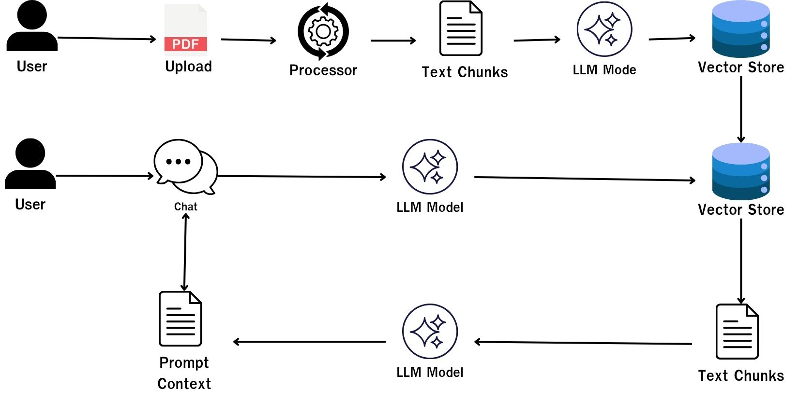

# 📚 PDF RAG chat application


A PDF document search, summarization, and Q&A application using Retrieval-Augmented Generation (RAG), powered by Google Gemini API, Pinecone Vector Database, and Streamlit.

## Preview
Deployed on Render it's severless must waiting around 3min after open web site.

* (Web Demo)[https://pdf-rag-workshop.onrender.com/]

## 🌟 Key Features
* 📄 PDF Processing & Chunking: Parses PDF files and chunks content into smaller segments, automatically capturing page number metadata.

* 🧠 Vector Embeddings: Converts text into 768-dimensional vector embeddings using Gemini's gemini-embedding-001 model.

* 🌲 Vector Search: Retrieves the most relevant context using cosine similarity on Pinecone Serverless Vector DB.

* 💬 Context-Aware Q&A Chat: Delivers accurate answers based on document context with exact page citations to prevent hallucinations.

* 📝 Full Document Summarization: Generates comprehensive summaries for entire PDF documents using the gemini-3.5-flash-lite model.

## 🛠️ Technology
| Systems  | Dependencies | Jobs  | 
|---|---|---|
| UI  | Streamlit  | UI interface  |
| PDF Extraction  | PyPDF + Langchain Text Splitter  | Convert PDF to text chunk  |
| Embedding Mode  | gemini-embedding-001  | Vector with 768 dimensions  |
| Vector Database | Pinecone Serverless Index | Vector data storing and similary search
| LLM Model | gemini-3.5-flash-lite | Analystor question and answer

## 📂 Project Structure
```
pdf-rag-workshop/
│
├── src/                  # All service
│   ├── config.py         # Configuration & Environment Variables
│   ├── sanitizer.py      # Redactor
│   ├── pdf_loader.py     # PDF chunker
│   ├── vector_store.py   # Pinecone (Create Index, Upsert, Query) vector store
│   └── rag_engine.py     # Gemini API (Embeddings, RAG, Summary)
│
└── app.py                # Streamlit UI
```

## 🚀 Setup & Usage (on local)

1. Install Makefile 
[Docs](https://makefiletutorial.com/) 
[Download windows](https://gnuwin32.sourceforge.net/packages/make.htm)

2. Open Virtual Environment
macOS/Linux: source venv/bin/activate
Windows (PowerShell): .\venv\Scripts\Activate.ps1

3. Create ```.env``` and fill all variable follow ```.env.template```

4. Call this command sequently```$make before-init``` ```$make init``` ```$make run```

5. Web browser will open ```http://localhost:8501``` automaticly

## 🔄 Apllication Workflow

1. Upload PDF documents on Sidebar

2. Asking question about PDF directly on __Tab2__

3. Quick summarize PDF on __Tab3__

## System Architecture Diagram
